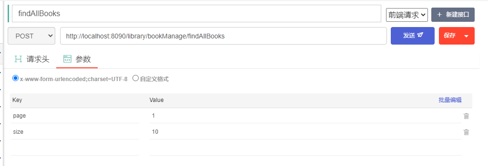
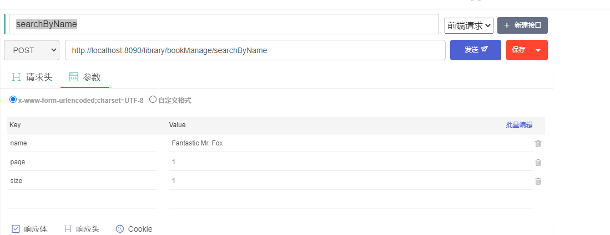
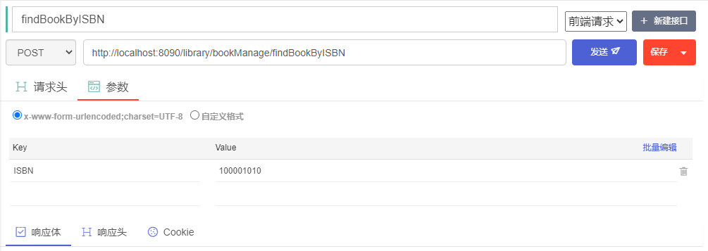
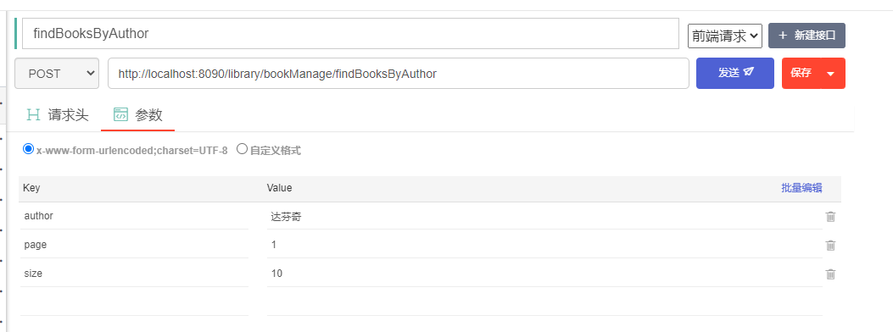
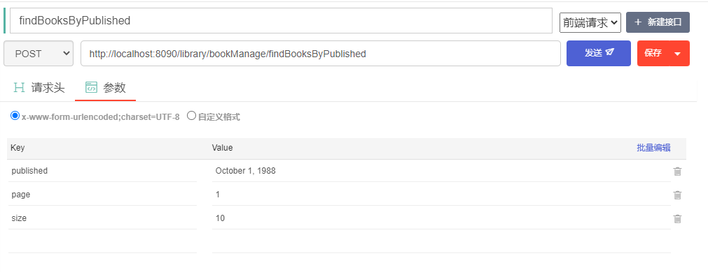
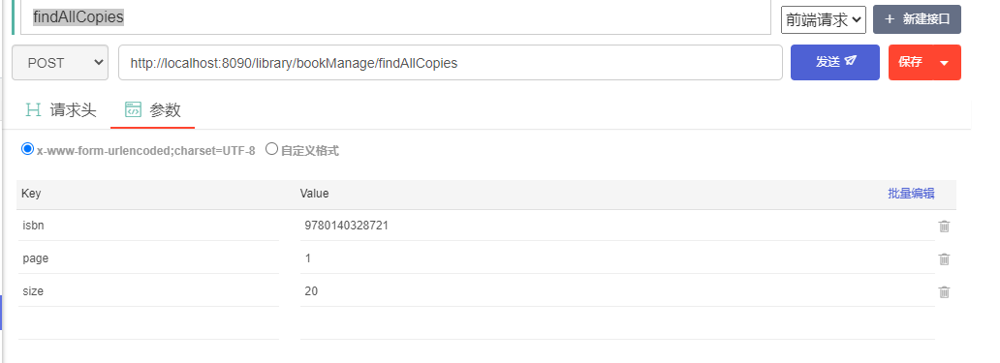
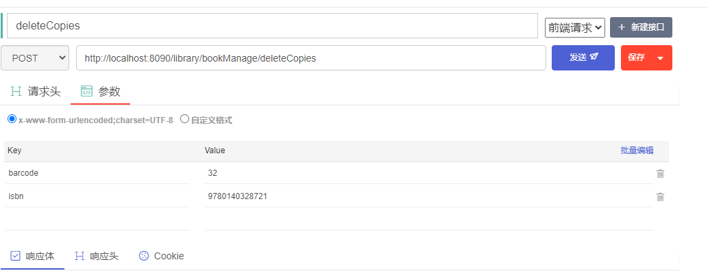
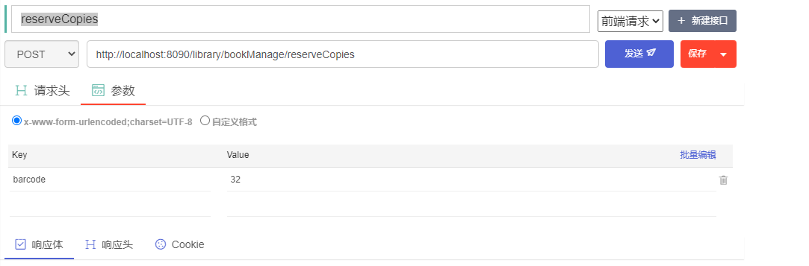
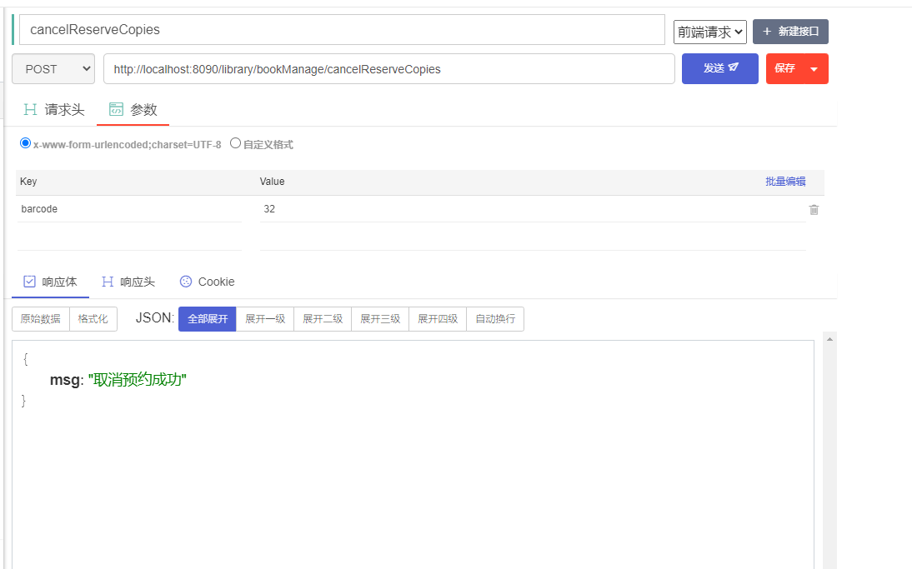
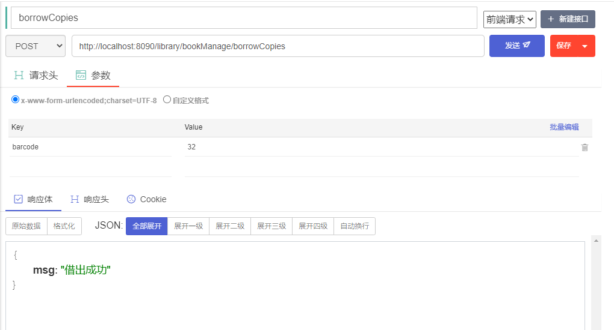

# Book以及Copies相关的接口

## 1. insert


## 2. changebook


## 3. deletebook


## 4. findAllBook



返回结果：

```json
{
"total": 3,
-"data": [
-{
"isbn": "100001010",
"bname": "小王子",
"author": "达芬奇",
"price": 10.5,
"type": "novel",
"introduction": "这是一本我很喜欢的小说",
"copiesnum": 10,
"publishing": "清华出版社",
"published": "2020-02",
"photoUrl": "www.hao123.com"
},
-{
"isbn": "100001011",
"bname": "语文",
"author": "达芬奇",
"price": 10.5,
"type": "课本",
"introduction": "这是一本我很喜欢的小说",
"copiesnum": 10,
"publishing": "北京出版社",
"published": "2020-03",
"photoUrl": "www.hao124.com"
},
-{
"isbn": "100001012",
"bname": "小王子",
"author": "达芬as",
"price": 10.5,
"type": "novel",
"introduction": "这是一本我很喜欢的小说",
"copiesnum": 10,
"publishing": "清华出版社11",
"published": "2020-06",
"photoUrl": "www.hao123.com"
}
]
}
```

## 5. searchByName



返回结果：

```json
{
"total": 2,
-"data": [
-{
"isbn": "100001010",
"bname": "小王子",
"author": "达芬奇",
"price": 10.5,
"type": "novel",
"introduction": "这是一本我很喜欢的小说",
"copiesnum": 10,
"publishing": "清华出版社",
"published": "2020-02",
"photoUrl": "www.hao123.com"
},
-{
"isbn": "100001012",
"bname": "小王子",
"author": "达芬as",
"price": 10.5,
"type": "novel",
"introduction": "这是一本我很喜欢的小说",
"copiesnum": 10,
"publishing": "清华出版社11",
"published": "2020-06",
"photoUrl": "www.hao123.com"
}
]
}
```


## 6. findBookByISBN



返回结果：

```json
{
"isbn": "100001010",
"bname": "小王子",
"author": "达芬奇",
"price": 10.5,
"type": "novel",
"introduction": "这是一本我很喜欢的小说",
"copiesnum": 10,
"publishing": "清华出版社",
"published": "2020-02",
"photoUrl": "www.hao123.com"
}
```

## 7. findBooksByAuthor



返回结果：

```json
{
"total": 2,
-"data": [
-{
"isbn": "100001010",
"bname": "小王子",
"author": "达芬奇",
"price": 10.5,
"type": "novel",
"introduction": "这是一本我很喜欢的小说",
"copiesnum": 10,
"publishing": "清华出版社",
"published": "2020-02",
"photoUrl": "www.hao123.com"
},
-{
"isbn": "100001011",
"bname": "语文",
"author": "达芬奇",
"price": 10.5,
"type": "课本",
"introduction": "这是一本我很喜欢的小说",
"copiesnum": 10,
"publishing": "北京出版社",
"published": "2020-03",
"photoUrl": "www.hao124.com"
}
]
}
```


## 8. findBooksByPublished



返回结果:

```json
{
"total": 1,
-"data": [
-{
"isbn": "9780140328721",
"bname": "Fantastic Mr. Fox",
"author": "Roald Dahl",
"price": 10,
"type": "Animals",
"introduction": "The main character of Fantastic Mr. Fox is an extremely clever anthropomorphized fox named Mr. Fox. He lives with his wife and four little foxes. In order to feed his family, he steals food from the cruel, brutish farmers named Boggis, Bunce, and Bean every night.\\r\\n\\r\\nFinally tired of being constantly outwitted by Mr. Fox, the farmers attempt to capture and kill him. The foxes escape in time by burrowing deep into the ground. The farmers decide to wait outside the hole for the foxes to emerge. Unable to leave the hole and steal food, Mr. Fox and his family begin to starve. Mr. Fox devises a plan to steal food from the farmers by tunneling into the ground and borrowing into the farmer's houses.\\r\\n\\r\\nAided by a friendly Badger, the animals bring the stolen food back and Mrs. Fox prepares a great celebratory banquet attended by the other starving animals and their families. Mr. Fox invites all the animals to live with him underground and says that he will provide food for them daily thanks to his underground passages. All the animals live happily and safely, while the farmers remain waiting outside in vain for Mr. Fox to show up.",
"copiesnum": 10,
"publishing": "Puffin",
"published": "October 1, 1988",
"photoUrl": "https://covers.openlibrary.org/b/id/8739161-M.jpg"
}
]
}
```

## 9. findAllCopies



返回结果：

```json
{
"total": 33,
-"data": [
-{
"barcode": 2,
"isbn": "9780140328721",
"racknum": "B101, 1st Floor, South Building, 2 A, 5 columns, 1-3 floors",
"reserved": 0,
"borrowed": 0
},
-{
"barcode": 4,
"isbn": "9780140328721",
"racknum": "B101, 1st Floor, South Building, 2 A, 5 columns, 1-3 floors",
"reserved": 0,
"borrowed": 0
},
-{
"barcode": 15,
"isbn": "9780140328721",
"racknum": "B101, 1st Floor, South Building, 2 A, 5 columns, 1-3 floors",
"reserved": 0,
"borrowed": 0
},
-{
"barcode": 16,
"isbn": "9780140328721",
"racknum": "B101, 1st Floor, South Building, 2 A, 5 columns, 1-3 floors",
"reserved": 0,
"borrowed": 0
},
-{
"barcode": 17,
"isbn": "9780140328721",
"racknum": "B101, 1st Floor, South Building, 2 A, 5 columns, 1-3 floors",
"reserved": 0,
"borrowed": 0
},
-{
"barcode": 18,
"isbn": "9780140328721",
"racknum": "B101, 1st Floor, South Building, 2 A, 5 columns, 1-3 floors",
"reserved": 0,
"borrowed": 0
},
-{
"barcode": 19,
"isbn": "9780140328721",
"racknum": "B101, 1st Floor, South Building, 2 A, 5 columns, 1-3 floors",
"reserved": 0,
"borrowed": 0
},
-{
"barcode": 20,
"isbn": "9780140328721",
"racknum": "B101, 1st Floor, South Building, 2 A, 5 columns, 1-3 floors",
"reserved": 0,
"borrowed": 0
},
-{
"barcode": 21,
"isbn": "9780140328721",
"racknum": "B101, 1st Floor, South Building, 2 A, 5 columns, 1-3 floors",
"reserved": 0,
"borrowed": 0
},
-{
"barcode": 22,
"isbn": "9780140328721",
"racknum": "B101, 1st Floor, South Building, 2 A, 5 columns, 1-3 floors",
"reserved": 0,
"borrowed": 0
},
-{
"barcode": 23,
"isbn": "9780140328721",
"racknum": "B101, 1st Floor, South Building, 2 A, 5 columns, 1-3 floors",
"reserved": 0,
"borrowed": 0
},
-{
"barcode": 24,
"isbn": "9780140328721",
"racknum": "B101, 1st Floor, South Building, 2 A, 5 columns, 1-3 floors",
"reserved": 0,
"borrowed": 0
},
-{
"barcode": 25,
"isbn": "9780140328721",
"racknum": "B101, 1st Floor, South Building, 2 A, 5 columns, 1-3 floors",
"reserved": 0,
"borrowed": 0
},
-{
"barcode": 26,
"isbn": "9780140328721",
"racknum": "B101, 1st Floor, South Building, 2 A, 5 columns, 1-3 floors",
"reserved": 0,
"borrowed": 0
},
-{
"barcode": 27,
"isbn": "9780140328721",
"racknum": "B101, 1st Floor, South Building, 2 A, 5 columns, 1-3 floors",
"reserved": 0,
"borrowed": 0
},
-{
"barcode": 28,
"isbn": "9780140328721",
"racknum": "B101, 1st Floor, South Building, 2 A, 5 columns, 1-3 floors",
"reserved": 0,
"borrowed": 0
},
-{
"barcode": 29,
"isbn": "9780140328721",
"racknum": "B101, 1st Floor, South Building, 2 A, 5 columns, 1-3 floors",
"reserved": 0,
"borrowed": 0
},
-{
"barcode": 30,
"isbn": "9780140328721",
"racknum": "B101, 1st Floor, South Building, 2 A, 5 columns, 1-3 floors",
"reserved": 0,
"borrowed": 0
},
-{
"barcode": 31,
"isbn": "9780140328721",
"racknum": "B101, 1st Floor, South Building, 2 A, 5 columns, 1-3 floors",
"reserved": 0,
"borrowed": 0
},
-{
"barcode": 32,
"isbn": "9780140328721",
"racknum": "B101, 1st Floor, South Building, 2 A, 5 columns, 1-3 floors",
"reserved": 0,
"borrowed": 0
}
]
}
```


## 10. deleteCopies



返回结果：

```json
{
"msg": "删除成功"
}
```

## 11. reserveCopies 预约



返回结果：

```json
{
msg": "预约成功"
}
```


## 12. cancelReserveCopies 取消预约



## 13. borrowCopies 借出




## 14. cancelBorrowCopies还书

