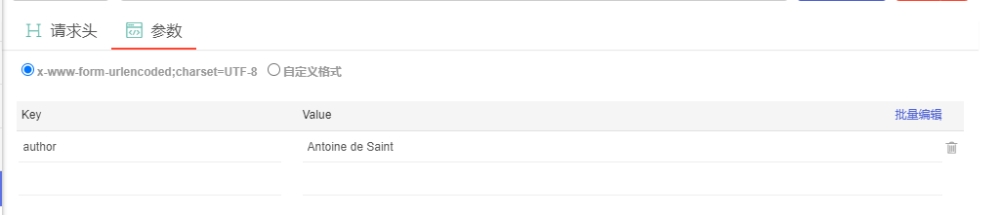
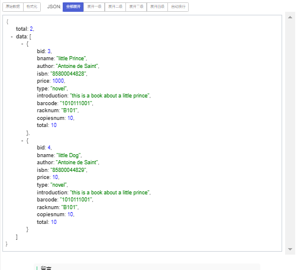

#	用户功能

##	查看用户自己的借阅记录

1. URL 地址：localhost:8090/library/member/viewBorrow
2. 请求方式：post
3. 请求参数：无
4. 接口返回：

```json
[
    {
        "borrow_id": 7,
        "reader_id": 19030502,
        "book_id": 5,
        "book_name": "small dog",
        "lend_date": "2022-04-09",
        "back_date": "2022-04-29"
    },
    {
        "borrow_id": 8,
        "reader_id": 19030502,
        "book_id": 6,
        "book_name": "cat",
        "lend_date": "2022-04-09",
        "back_date": "2022-04-29"
    }
]
```

5. **是否需要 Cookie：是**


##	借书操作

1. URL 地址：localhost:8090/library/member/borrowBook
2. 请求方式：post
3. 请求参数：

| 参数名  | 参数类型 | 参数长度 |    参数说明     | 必填 |
| :-----: | :------: | :------: | :-------------: | :--: |
| book_id |   int    |          | 要借阅的书籍 id |  Y   |

4. 接口返回：

```json
# A: 借阅成功
{
    "msg": "借书成功"
}

# B: card_state异常
{
    "msg": "card_state异常"
}

# C: 超出最大借阅数
{
    "msg": "超出最大借阅数"
}

# D: 书已被全部借出
{
    "msg": "书已被全部借出"
}
```

5. **是否需要 Cookie：是**


##	续借操作

1. URL 地址：localhost:8090/library/member/renewBook
2. 请求方式：post
3. 请求参数：

|  参数名   | 参数类型 | 参数长度 | 参数说明 | 必填 |
| :-------: | :------: | :------: | :------: | :--: |
| borrow_id |   int    |          |  借阅号  |  Y   |

1. 接口返回：

```json
# A: 续借成功
{
    "msg": "续借成功"
}

# B: card_state异常
{
    "msg": "card_state异常"
}

# C: 已超期
{
    "msg": "已超期"
}

# D: 超过最大续借次数
{
    "msg": "超过最大续借次数"
}
```

5. **是否需要 Cookie：是**


##	还书操作

1. URL 地址：localhost:8090/library/member/returnBook
2. 请求方式：post
3. 请求参数：

|  参数名   | 参数类型 | 参数长度 | 参数说明 | 必填 |
| :-------: | :------: | :------: | :------: | :--: |
| borrow_id |   int    |          |  借阅号  |  Y   |

4. 接口返回：

```json
# A: 还书成功
{
    "msg": "还书成功"
}
# B: card_state异常
{
    "msg": "card_state异常"
}
# C: 余额不足
{
    "msg": "余额不足"
}
```

5. **是否需要 Cookie：是**


##	预约操作

1. URL 地址：localhost:8090/library/member/reserveBook
2. 请求方式：post
3. 请求参数：

| 参数名  | 参数类型 | 参数长度 | 参数说明 | 必填 |
| :-----: | :------: | :------: | :------: | :--: |
| book_id |   int    |          | 书籍 id  |  Y   |

4. 接口返回：

```json
# A: 预约成功
{
    "msg": "预约成功"
}
# B: card_state异常
{
    "msg": "card_state异常"
}
# C: 不可重复预约
{
    "msg": "不可重复预约"
}
# D: 超出最大借阅数
{
    "msg": "超出最大借阅数"
}
```

5. **是否需要 Cookie：是**


# 图书馆里book management

## 新增图书

1. URL 地址：http://localhost:8090/library/bookManage/insert

2. 请求方式：post

3. 请求参数：

 

|     Key      | value                                |
| :----------: | ------------------------------------ |
|     bid      | 0                                    |
|    bname     | little Dog                           |
|    author    | Antoine de Saint                     |
|     isbn     | 85800044829                          |
|    price     | 10                                   |
|     type     | novel                                |
| introduction | this is a book about a little prince |
|   barcode    | 1010111001                           |
|   racknum    | B101                                 |
|  copiesnum   | 10                                   |
|    total     | 10                                   |


4. 返回结果：

```json
{
"msg": "添加失败，数据库已有该书"
}
```

## 根据作者查找图书

1. URL 地址：http://localhost:8090/library/bookManage/findBooksByAuthor
2. 请求方式：post
3. 请求参数：

返回结果：



``` json
{
"total": 2,
-"data": [
-{
"bid": 3,
"bname": "little Prince",
"author": "Antoine de Saint",
"isbn": "85800044828",
"price": 1000,
"type": "novel",
"introduction": "this is a book about a little prince",
"barcode": "1010111001",
"racknum": "B101",
"copiesnum": 10,
"total": 10
},
-{
"bid": 4,
"bname": "little Dog",
"author": "Antoine de Saint",
"isbn": "85800044829",
"price": 10,
"type": "novel",
"introduction": "this is a book about a little prince",
"barcode": "1010111001",
"racknum": "B101",
"copiesnum": 10,
"total": 10
}
]
}
```

## 根据id及书名查找图书类似根据作者查找

